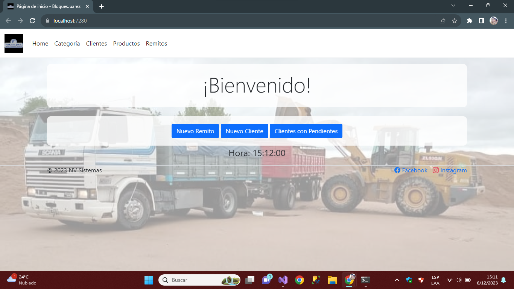
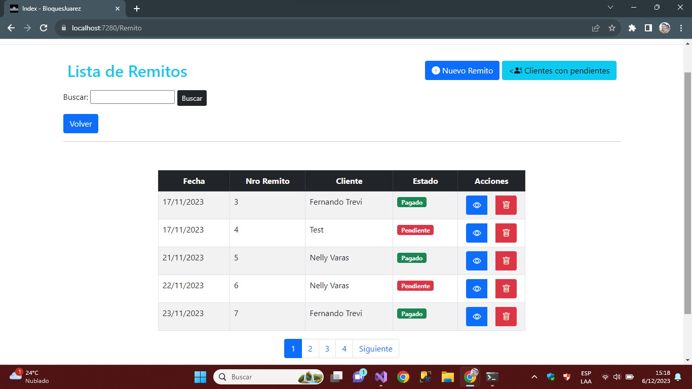
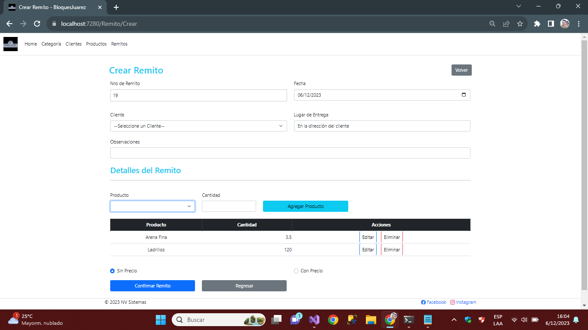
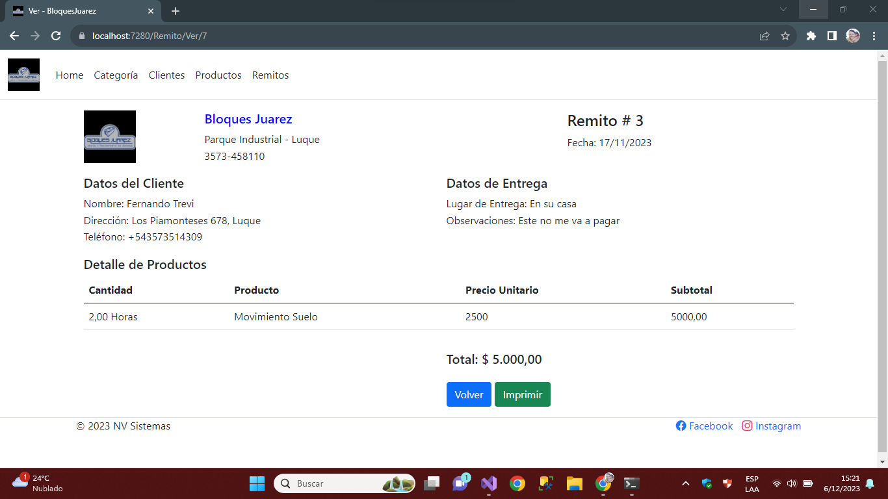
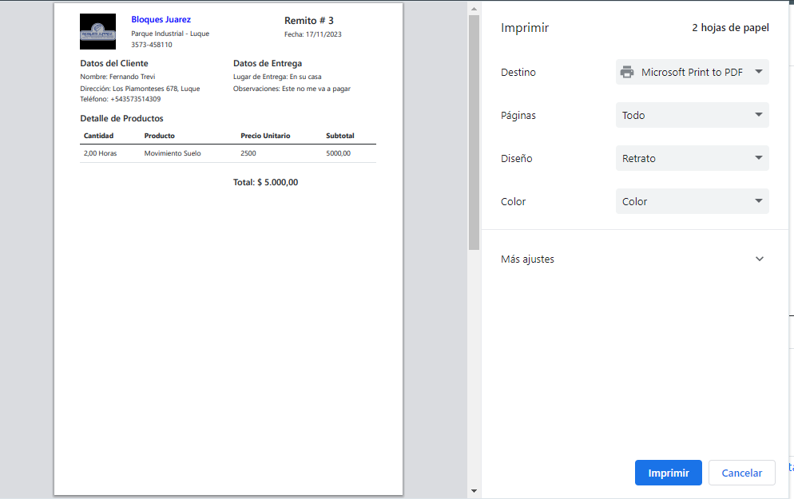
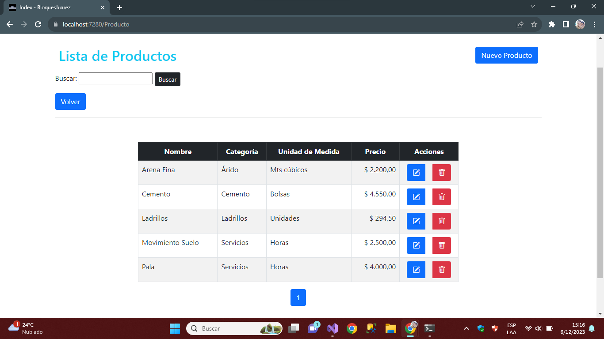
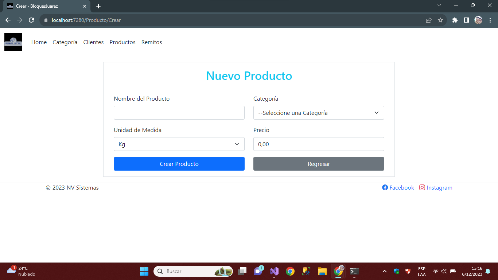
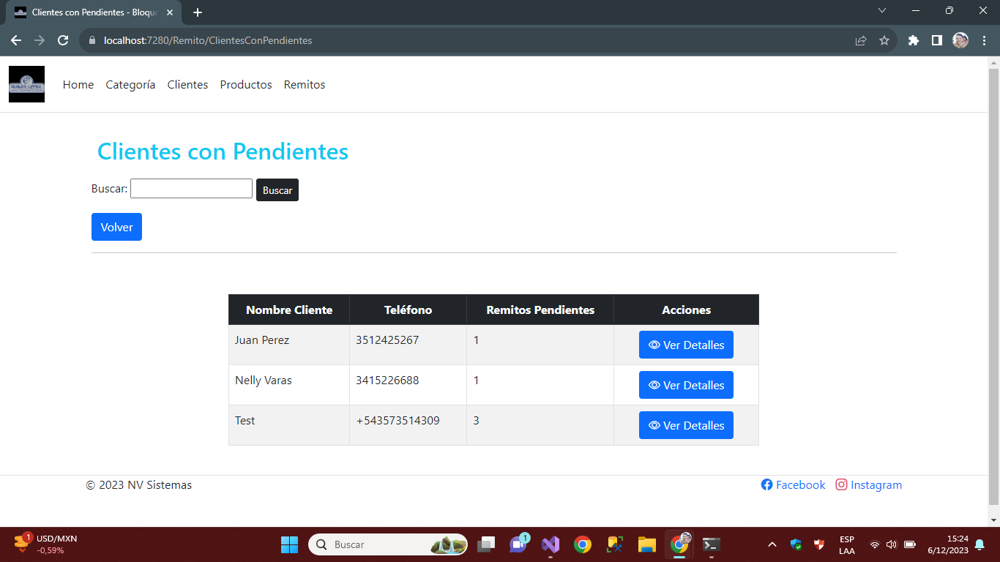
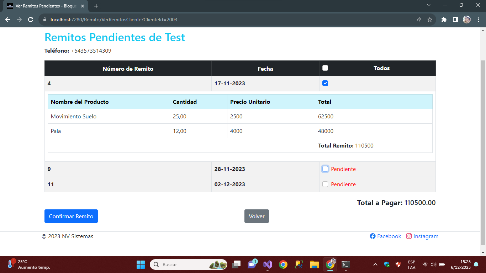

# BloquesJuarez

El presente proyecto tiene como objetivo el desarrollo de un Sistema Informático para la empresa "Bloques Juarez", especializada en la venta de materiales y movimiento de suelo. El sistema automatiza procesos clave, mejorando la eficiencia y productividad de la empresa, reduciendo errores y ofreciendo un servicio de calidad a los clientes.

## Características Principales

- **Automatización de Ventas:**
  - Gestión de remitos, clientes, cuentas corrientes y productos.
  - Acceso en tiempo real desde cualquier dispositivo con conexión a Internet.

- **Control Logístico:**
  - Estadísticas y control del transporte y logística.
  - Información actualizada para una toma de decisiones efectiva.

- **Tecnología Utilizada:**
  - Desarrollado en ASP.NET Core.
  - Sql Server 2019.

## Funcionalidades Actuales

Actualmente se ha desplegado en la PC del cliente, en un servidor local con las siguientes funcionalidades:

- **ABM (Alta, Baja, Modificación) de Clientes, Categorías y Productos.**
- 
- **Gestión de Remitos:**
  - Carga de remitos abiertos (sin precio) y remitos completos.
  - Listado y filtro de clientes con remitos pendientes.
  - Detalle de remitos pendientes por cliente.
  - Confirmación y cambio de estado de remitos pendientes.
  - Impresión de remitos por duplicado y detalles de pendientes.

## Capturas de Pantalla

A continuación, algunas imágenes que destacan las principales funciones del sistema:

1. **Home:**
   Página principal, que cuenta con acceso directo a las funciones más utilizadas.
   

2. **Carga de Remitos:**
   
   
   
   
   
   
3. **Funciones ABM Clientes/Productos/Categoría**

     Todos lo ABM cuentan con la misma lógica y distribución de los controles para mantener una coherencia general. Los index cuentan con funciones de paginación y búsqueda.
   
   
   
4. **Listado de Clientes con Remitos Pendientes:**
   
   

## Contribuciones

¡Contribuciones son bienvenidas! Si tienes sugerencias o encuentras problemas, por favor, abre un [issue](https://github.com/tu-usuario/BloquesJuarez/issues).

## Contacto

Para más información, contacta al desarrollador:

- Nombre: [Fernando Trevisani]
- Correo Electrónico: [trevi83.ft@gmail.com]
- LinkedIn: [FernandoTrevi]
